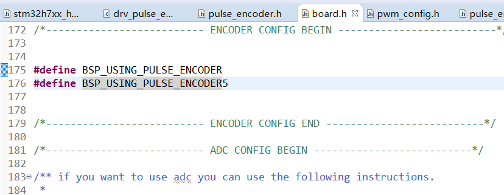
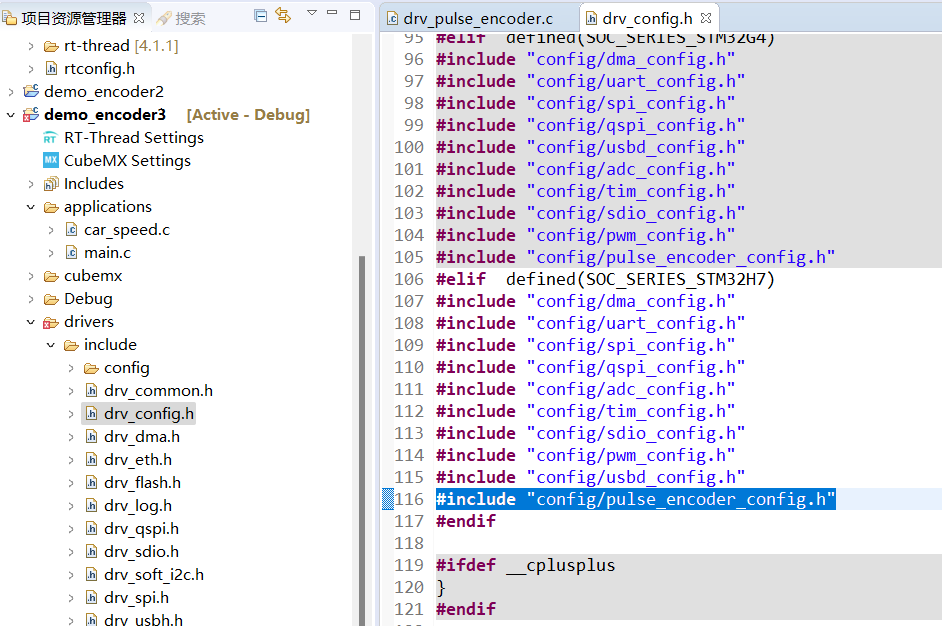
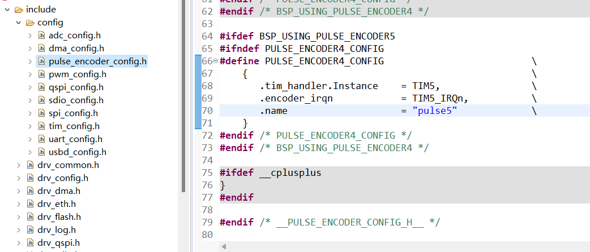
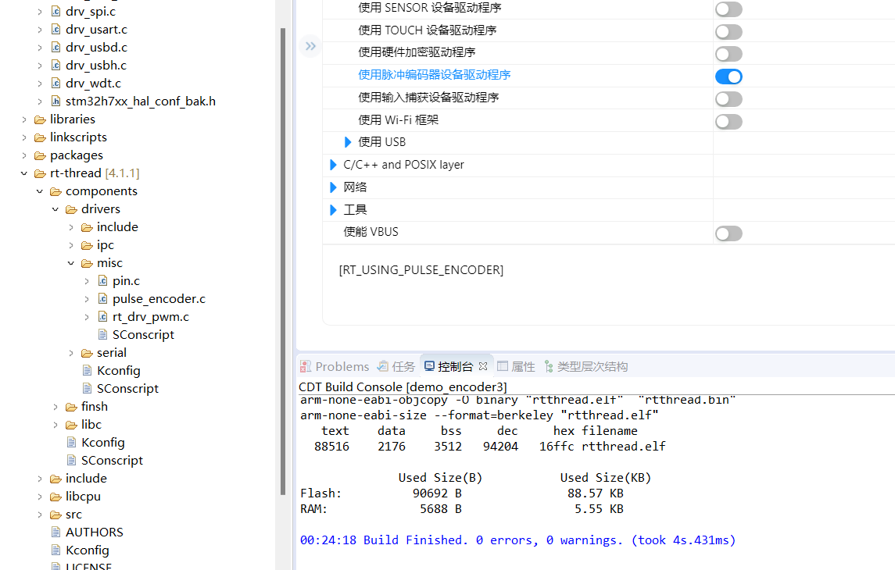

# 基于rt-thread studio的stm32 demo
- pwm demo upload
- WIFI demo upload
- OLED demo upload
- stm32 demo based Clion upload
- Encoder model

    通过stm32cubemx进行配置，引脚为encoder model T1 and T2 模式
  加入“pulse_encoder_config.h”和“pulse_encoder_config.c”文件
  
board中并无此句，需添加
 

添加pulse_encoder_config.h文件到索引列表

可以获取所定义的编码器信息

添加编码器软件框架

- OV5640
stm32h7xx_hal_conf.h打开#define HAL_DCMI_MODULE_ENABLED，不然无法识别dcmi hal文件
- demo_drv_ov5640_V1
实现SCCH检测到模块的功能