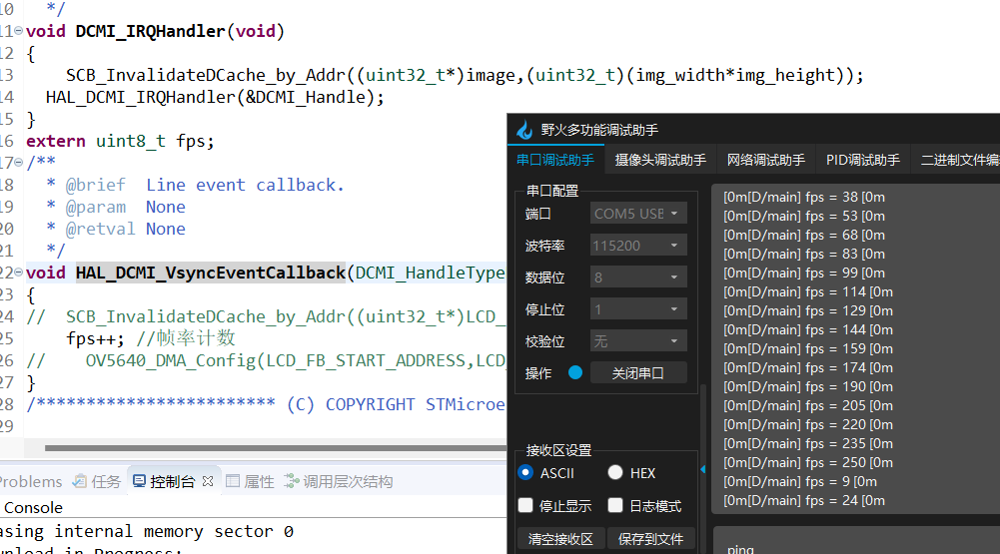

# 基于rt-thread studio的stm32 demo
- pwm demo upload
- WIFI demo upload
- OLED demo upload
- stm32 demo based Clion upload
- Encoder model

    通过stm32cubemx进行配置，引脚为encoder model T1 and T2 模式
  加入“pulse_encoder_config.h”和“pulse_encoder_config.c”文件
  
board中并无此句，需添加
 

添加pulse_encoder_config.h文件到索引列表

可以获取所定义的编码器信息

添加编码器软件框架

- OV5640
stm32h7xx_hal_conf.h打开#define HAL_DCMI_MODULE_ENABLED，不然无法识别dcmi hal文件
- demo_drv_ov5640_V1
实现SCCH检测到模块的功能
- demo_OV_v2
实现加入外部SDRAM
教程链接：https://mp.weixin.qq.com/s/iC36R6myj3drSEsJWIOc6Qs
- demo_OV_v3
实现DCMI、DMA中断

- demo_run
  
结合MPU6050，其中，在本项目中，机器人持续执行，即编码器读取实际的电机速度大小一致，使用PID进行调节，这里使用PI速度环进行控制，当需要进行转向功能时，则停止，控制左右方向进行旋转，也是PID的转向环控制，向右旋转时，右电机停止，左电机向前，且PWM占空比随角度逐渐逼近而变化，采用PID的思想，快速稳定地旋转到指定角度。

- demo_OV_Crop

实现单张图片拍照和图片裁剪为指定大小
  

